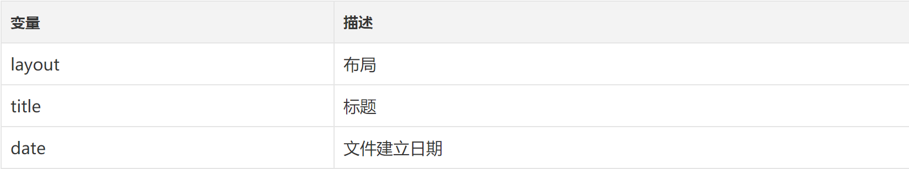
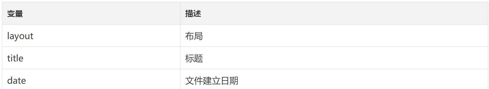
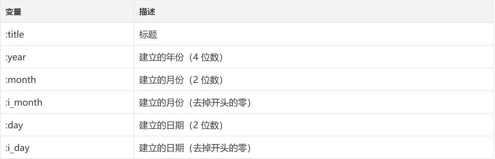

<h1>关于Hexo的主题下载:</h1>

<p>下载地址: https://hexo.io/themes/</p>

<p>一般下载的地址为github，下面有主题需要的配置步骤。</p>

<h1>Hexo中常用的命令:</h1>

<p>其中命令可以连用，例如:hexo d -g 生成加部署</p>

<h2>简写</h2>

<blockquote><p>hexo n &quot;我的博客&quot; == hexo new &quot;我的博客&quot; #新建文章
hexo p == hexo publish
hexo g == hexo generate#生成
hexo s == hexo server #启动服务预览
hexo d == hexo deploy#部署</p></blockquote>

<h2>服务器</h2>

<blockquote><p>hexo server #Hexo 会监视文件变动并自动更新，您无须重启服务器。
hexo server -s #静态模式
hexo server -p 5000 #更改端口
hexo server -i 192.168.1.1 #自定义 IP
hexo clean #清除缓存 网页正常情况下可以忽略此条命令
hexo g #生成静态网页
hexo d #开始部署</p></blockquote>

<h2>监视文件变动</h2>

<blockquote><p>hexo generate #使用 Hexo 生成静态文件快速而且简单
hexo generate --watch #监视文件变动</p></blockquote>

<h2>完成后部署</h2>

<blockquote><p>hexo generate --deploy
hexo deploy --generate
可以直接使用 hexo d -g</p></blockquote>

<h2>草稿</h2>

<blockquote><p>hexo publish [layout] &lt;title&gt;</p></blockquote>

<h2>模版</h2>

<blockquote><p>hexo new &quot;postName&quot; #新建文章
hexo new page &quot;pageName&quot; #新建页面
hexo generate #生成静态页面至public目录
hexo server #开启预览访问端口（默认端口4000，&#39;ctrl + c&#39;关闭server）
hexo deploy #将.deploy目录部署到GitHub</p><p>hexo new [layout] &lt;title&gt;
hexo new photo &quot;My Gallery&quot;
hexo new &quot;Hello World&quot; --lang tw</p></blockquote>

<p></p>

<blockquote><p>title: 使用Hexo搭建个人博客
layout: post
date: 2014-03-03 19:07:43
comments: true
categories: Blog
tags: [Hexo]
keywords: Hexo, Blog
description: 生命在于折腾，又把博客折腾到Hexo了。给Hexo点赞。</p></blockquote>

<h2>模版（Scaffold）</h2>

<p>hexo new photo &quot;My Gallery&quot;</p>

<p></p>

<h2>设置文章摘要</h2>

<blockquote><p>以上是文章摘要 &lt;!--more--&gt; 以下是余下全文 </p></blockquote>

<h2>写作</h2>

<blockquote><p>hexo new page &lt;title&gt;
hexo new post &lt;title&gt;</p></blockquote>

<p></p>

<h2>推送到服务器上</h2>

<blockquote><p>hexo n #写文章
hexo g #生成
hexo d #部署 #可与hexo g合并为 hexo d -g</p></blockquote>

<h2>报错</h2>

<blockquote><p>ERROR Deployer not found: git</p></blockquote>

<h2>解决方法</h2>

<blockquote><p>npm install hexo-deployer-git --save</p></blockquote>

<h1>部署类型设置git</h1>

<blockquote><p>hexo 3.0 部署类型不再是github，_config.yml 中修改</p><h1>Deployment</h1><p>Docs: http://hexo.io/docs/deployment.html
deploy:
  type: git
  repository: git@<strong>*.github.com:</strong><em>/**</em>.github.io.git
  branch: master</p></blockquote>

<h2>xcodebuild</h2>

<blockquote><p>xcode-select: error: tool &#39;xcodebuild&#39; requires Xcode, but active developer directory &#39;/Library/Developer/CommandLineTools&#39; is a command line tools instance</p><p>npm install bcrypt</p></blockquote>

<h2>RSS不显示</h2>

<blockquote><p>安装RSS插件
npm install hexo-generator-feed --save
开启RSS功能
编辑hexo/_config.yml，添加如下代码：
rss: /atom.xml #rss地址  默认即可</p></blockquote>

<h2>开启评论</h2>

<blockquote><p>1.我使用多说代替自带的评论，在多说 网站注册 &gt; 后台管理 &gt; 添加新站点 &gt; 工具 === 复制通用代码 里面有 short<em>name
在根目录 </em>config.yml 添加一行 disqus_shortname: jslite 是在多说注册时产生的
复制到 themes\landscape\layout_partial\article.ejs
把
```javascript
<% if (!index && post.comments && config.disqus_shortname){ %>
<section id="comments">
<div id="disqus_thread">
  <noscript>Please enable JavaScript to view the <a href="//disqus.com/?ref_noscript">comments powered by Disqus.</a></noscript>
</div>
</section>
<% } %>
```
改成</p></blockquote>


```javascript
<% if (!index && post.comments && config.disqus_shortname){ %>
  <section id="comments">
    <!-- 多说评论框 start -->
    <div class="ds-thread" data-thread-key="<%= post.layout %>-<%= post.slug %>" data-title="<%= post.title %>" data-url="<%= page.permalink %>"></div>
    <!-- 多说评论框 end -->
    <!-- 多说公共JS代码 start (一个网页只需插入一次) -->
    <script type="text/javascript">
    var duoshuoQuery = {short_name:'<%= config.disqus_shortname %>'};
      (function() {
        var ds = document.createElement('script');
        ds.type = 'text/javascript';ds.async = true;
        ds.src = (document.location.protocol == 'https:' ? 'https:' : 'http:') + '//static.duoshuo.com/embed.js';
        ds.charset = 'UTF-8';
        (document.getElementsByTagName('head')[0] 
         || document.getElementsByTagName('body')[0]).appendChild(ds);
      })();
      </script>
    <!-- 多说公共JS代码 end -->
  </section>
<% } %>
```

<h1>Hexo文章的写法</h1>

<blockquote><p>Hexo文章支持html和MarkDown语法，你不但可以单独使用这两个语法也可以混合使用。</p></blockquote>

<h2>关于MarkDown语法规则</h2>

<blockquote><p>链接: https://www.zybuluo.com/mdeditor</p></blockquote>
